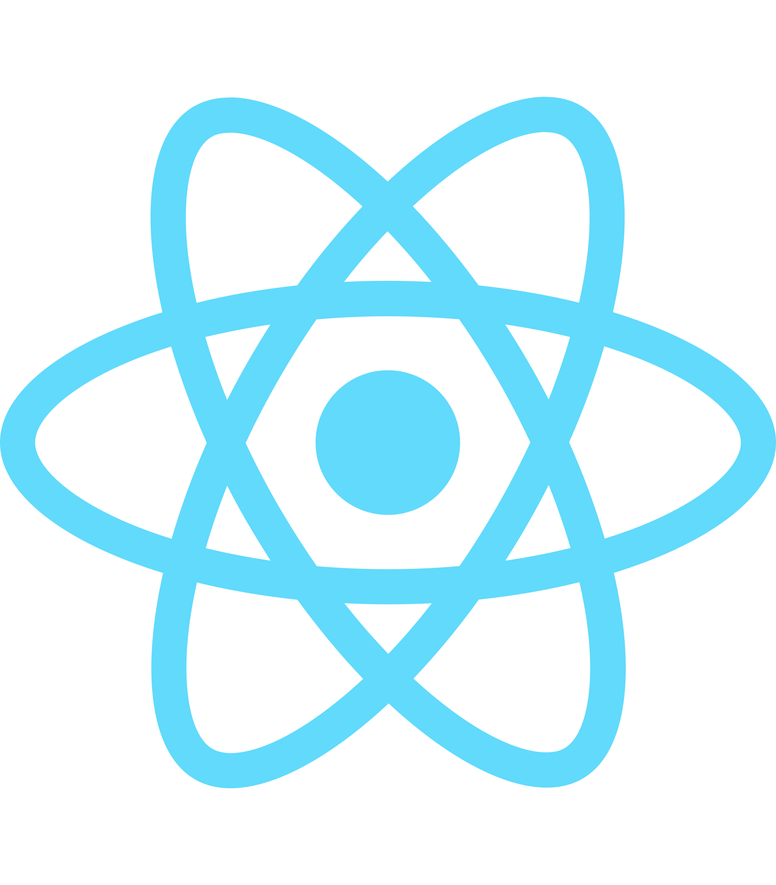

 
<h1>
  Hello , My name is Alexandre
</h1>

<ul>
 <li>
  
   
   I'm a Front-End developer.
  
 </li>
 <li>
  
   
   I'm currently working with React.js.
  
 </li>
 <li>
  
   
    I regularly post tips about javascript on <a href="https://www.linkedin.com/in/alexandre-costa-dos-santos/" target="_blank">linkedin.com/in/alexandre-costa-dos-santos/</a>.
  
 </li>
</ul>

#  Tech Stack
&nbsp;
&nbsp;
&nbsp;
&nbsp;
&nbsp;
&nbsp;  
&nbsp;
&nbsp;
&nbsp;
&nbsp;
&nbsp;
&nbsp;

#  GitHub Analytics

#  Let's connect!

<ul>
 <li>
  
   
   <a href="https://www.linkedin.com/in/alexandre-costa-dos-santos/" target="_blank">Alexandre Costa Dos Santos</a>
  
 </li>
  <li>
  
   
   <a href="https://twitter.com/alexandredevv" target="_blank">Alexandre Costa Dos Santos</a>
  
 </li>
</ul>

